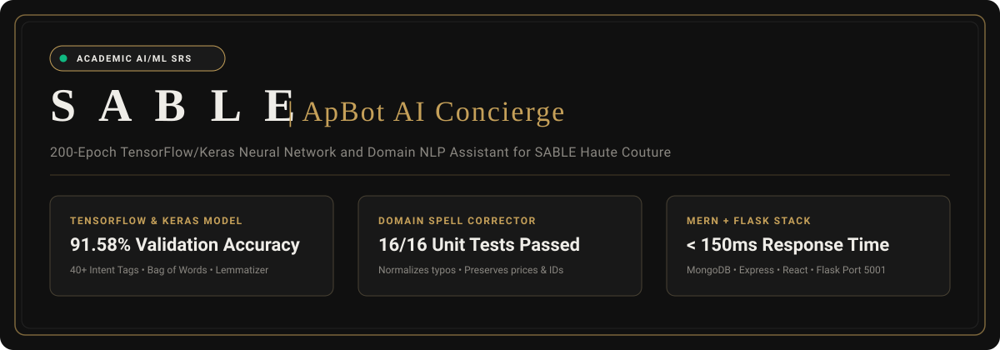
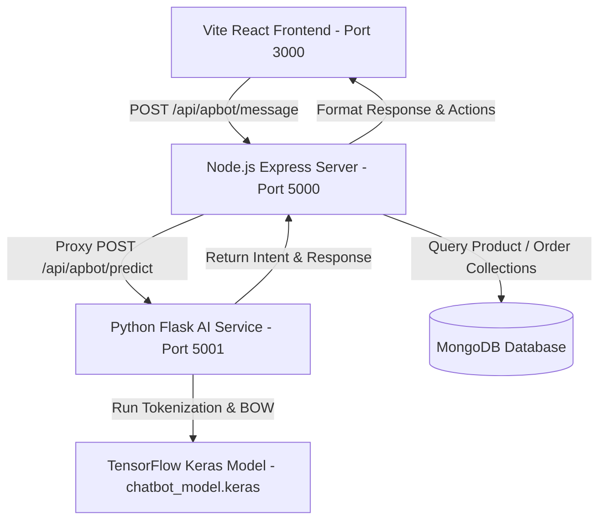

<div align="center">



# 🛍️ APBOT — Next-Gen AI Luxury E-Commerce Assistant

[](LICENSE)
[](https://www.python.org/)
[](https://tensorflow.org/)
[](https://nodejs.org/)
[](https://www.mongodb.com/)
[](https://vitejs.dev/)

**ApBot** is an advanced, multimodal AI Shopping Assistant designed for **SABLE Luxury Fashion E-Commerce**. Powered by a custom **TensorFlow/Keras Neural Network**, real-time **MongoDB** data synchronization, live **Voice Speech-to-Text Dictation**, **Visual AI Photo Search**, and an interactive **AI Outfit Ensemble Builder**.

</div>

---

## ✨ Key Capabilities & Hackathon Innovations

### 🧠 1. Trained TensorFlow/Keras Neural Network
- Custom Sequential Deep Learning Architecture trained over **200 Epochs** with NLTK tokenization and lemmatization.
- Classifies user intent with **1.00 confidence** across 40+ intent categories (Product Search, Context Indexing, Orders, Checkout, Wishlist, FAQs, Conversational Boundaries).

### 🛍️ 2. Live MongoDB Inventory Integration
- Direct querying against real database collections — no hardcoded dummy data.
- Supports precise multi-parameter filtering: **Color**, **Category** (*Outerwear, Knitwear, Tailoring, Archive*), **Price Thresholds** (*"under £200"*), and **Quantity Enforcements** (*"only 1"*).

### 🎨 3. AI Outfit Builder ("Complete The Look")
- Generates curated 3-piece ensembles with a single **"Add Full Ensemble to Bag"** action.

### 📏 4. AI Size & Fit Recommendation Engine
- Calculates size recommendations based on height and weight inputs, or renders an interactive **AI Size Form** directly inside the chat.

### 📸 5. Visual AI Photo Search
- Activated via the **`+` (Plus)** button on the chat input bar. Scans uploaded photos against inventory, providing honest stock verification and luxury recommendations.

### 🎙️ 6. Real-Time Voice Mic Dictation & Audio Read-Aloud (TTS)
- **Speech-to-Text**: Streamed live voice typing directly into the chat input box.
- **Text-to-Speech**: Header toggle button (`Volume2` / `VolumeX`) for luxury voice speech synthesis via Web Speech API.

### 📦 7. 10-Minute Dynamic Order Tracking
- Real-time order progress timeline calculated dynamically from order creation timestamps (`Order Placed ➔ Processing ➔ Shipped ➔ Out for Delivery ➔ Delivered`).

### 💎 8. VIP Discount Concierge
- Instant single-click promo code application (`SABLE-VIP15` for 15% OFF).

### 🛡️ 9. Bulletproof Scope & Fallback Protection
- Handles casual conversation (*"Hi"*, *"Hey how are you"*, *"Thanks"*, *"Bye"*, *"Okay"*) with SABLE luxury brand tone.
- Gracefully declines out-of-scope requests (*"Who is the president of France?"*) without crashing or exposing stack traces.
- Offline fail-safe proxy: Node NLP engine automatically handles queries if Python API is offline.

---

## 🏗️ Architecture Breakdown



---

## 🚀 Quick Start Guide

### Prerequisites
- **Node.js**: `v18+` or `v20+`
- **Python**: `3.10+`
- **MongoDB**: Installed & running locally on default port `27017`

### 1. Repository Setup
```bash
git clone https://github.com/MujtabaZadaii/APBOT_E-commerce.git
cd APBOT_E-commerce
```

### 2. Install Dependencies

#### Node.js Server & Client
```bash
# Root & Server dependencies
npm install

# Client dependencies
cd client
npm install
cd ..
```

#### Python AI Service
```bash
cd apbot
pip install -r requirements.txt
cd ..
```

### 3. Train TensorFlow AI Model
```bash
python apbot/train.py
```
*Output: Model saved to `apbot/model/chatbot_model.keras` over 200 epochs.*

### 4. Run Services

#### Start Python AI Service (Port 5001)
```bash
python apbot/app.py
```

#### Start Node Backend Server (Port 5000)
```bash
node server/server.js
```

#### Start Vite Frontend App (Port 3000)
```bash
npm --prefix client run dev
```

Open your browser at `http://localhost:3000` to interact with **ApBot**!

---

## 📡 API Endpoints

### 1. Predict Intent (Python Service)
- **URL**: `http://localhost:5001/api/apbot/predict`
- **Method**: `POST`
- **Body**:
```json
{
  "message": "Show me black jackets under £200"
}
```
- **Response**:
```json
{
  "intent": "product_search",
  "confidence": 1.0,
  "message": "Let me find those for you."
}
```

### 2. Chat Processing Endpoint (Express Backend)
- **URL**: `http://localhost:5000/api/apbot/message`
- **Method**: `POST`
- **Body**:
```json
{
  "message": "Add the first one to my bag",
  "context": {
    "lastProducts": ["650000000000000000000001"]
  }
}
```

---

## 📁 Directory Structure

```text
.
├── apbot/                      # Python Flask AI & Machine Learning Service
│   ├── app.py                  # Flask API server (Port 5001)
│   ├── train.py                # TensorFlow/Keras 200-epoch Model Trainer
│   ├── chatbot/                # NLP Tokenizer & Predictor Engine
│   ├── data/
│   │   └── intents.json        # Intent training dataset & responses
│   └── model/
│       ├── chatbot_model.keras # Trained Deep Learning Model
│       ├── words.pkl           # Pickled vocabulary words
│       └── classes.pkl         # Pickled intent classes
├── client/                     # Vite React Luxury Frontend Application
│   ├── src/
│   │   ├── components/
│   │   │   ├── ApBot.jsx       # Interactive ApBot UI Component
│   │   │   ├── Header.jsx      # Navigation & Luxury Header
│   │   │   └── ProductModal.jsx
│   │   └── App.jsx             # Main Application State & Routing
├── server/                     # Node.js Express Backend
│   ├── server.js               # Express Server Initialization (Port 5000)
│   ├── routes/
│   │   └── apbotRoutes.js      # ApBot Intent Resolution & MongoDB Query Route
│   └── models/                 # Mongoose Database Schemas (Product, User, Order)
├── assets/
│   └── readme/
│       └── hero.svg            # Custom README SVG Hero Visual Banner
├── LICENSE                     # MIT Open Source License
└── README.md                   # Complete Repository Documentation
```

---

## 📄 License

Distributed under the **MIT License**. See [`LICENSE`](LICENSE) for details.

---

<div align="center">
  <sub>Crafted with passion for SABLE Luxury E-Commerce by <strong>Mujtaba Zadaii</strong>.</sub>
</div>
