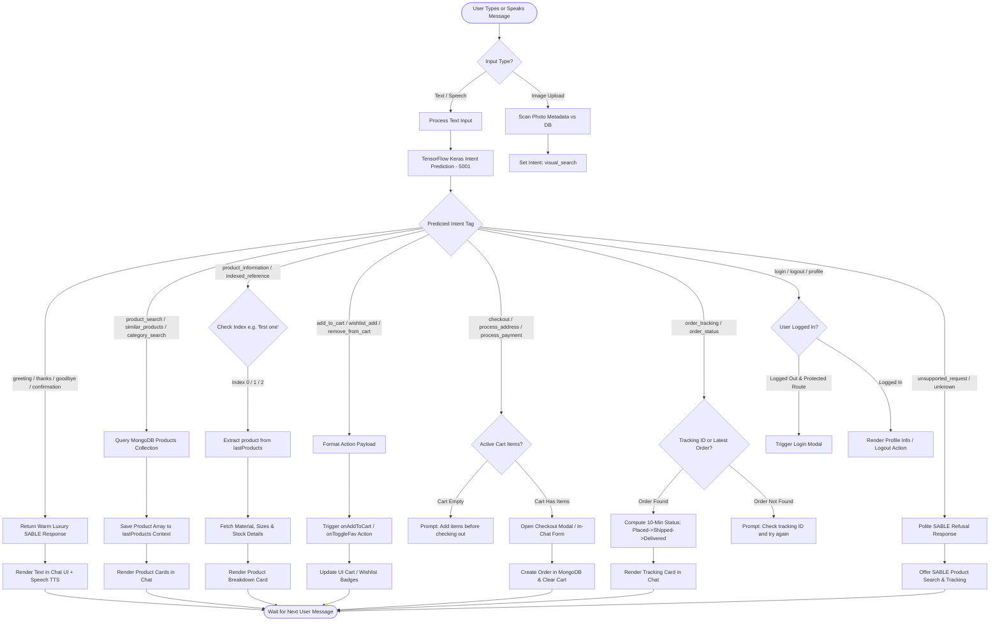

# APBOT — DIALOG FLOW & CONVERSATIONAL STATE MACHINE

---

## 🔁 DIALOG FLOW DIAGRAM

---

## 🧠 CONVERSATIONAL STATE MACHINE SPECIFICATION

| State Name | Trigger Keywords | State Variables Retained | Next Possible Actions |
| :--- | :--- | :--- | :--- |
| **`IDLE / GREETING`** | `"Hi"`, `"Hello"`, `"Good morning"` | None | Product search, category browse, general FAQs |
| **`SEARCH_ACTIVE`** | `"Show me black jackets"` | `lastProducts`, `colorFilter`, `priceFilter` | Filter by price, pick item ("first one"), add to bag |
| **`PRODUCT_REFERENCED`** | `"Show me the first one"`, `"Tell me about it"` | `selectedProductIndex`, `lastProducts[0]` | Add to cart, save to wishlist, request similar items |
| **`CHECKOUT_AWAITING_ADDRESS`** | `"I want to checkout"` | `cartItems`, `checkoutState: 'awaiting_address'` | Enter shipping address, submit payment |
| **`CHECKOUT_AWAITING_PAYMENT`** | Address submitted | `cartItems`, `shippingAddress`, `checkoutState: 'awaiting_payment'` | Enter card details, finalize purchase |
| **`ORDER_TRACKING_ACTIVE`** | `"Track SBL-12345"` | `activeOrderId`, `createdAtTimestamp` | Refresh status, view order history, contact support |
| **`UNSUPPORTED_BOUNDARY`** | Out-of-scope question | Previous context preserved | Redirect to SABLE browsing |
