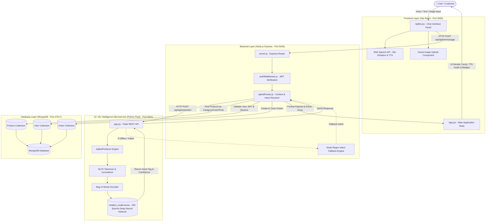

# SABLE & APBOT — SYSTEM ARCHITECTURE DIAGRAM & DATA FLOW

---

## 🏛️ SYSTEM ARCHITECTURE DIAGRAM

---

## 🔄 DATA FLOW SEQUENCE

1. **Input Stage**: The user enters a natural text message, dictates via speech microphone, or uploads an image.
2. **Client Dispatch**: `ApBot.jsx` sends a `POST /api/apbot/message` request to the Node.js backend (Port 5000) containing the `message`, `JWT Authorization Header`, and current `conversationContext` (e.g. `lastProducts`, `cartItems`).
3. **Intent Classification**: Express forwards the message text to the Python Flask AI service (Port 5001) via `POST /api/apbot/predict`.
4. **Deep Learning Inference**: Python executes `nltk.word_tokenize`, lemmatization, and Bag of Words encoding. The input vector is passed through `chatbot_model.keras` to output predicted intent tag and confidence score.
5. **Contextual Resolution & DB Querying**: Node.js receives the predicted intent. If the query references specific products (*"the first one"*), previous context filters are applied. Node queries MongoDB collections (`Product`, `User`, `Order`) for real data.
6. **Action Dispatch**: Node packages the response message and an array of front-end action triggers (`add_to_cart`, `wishlist_add`, `open_checkout`, `navigate`, `login`).
7. **UI Mutation & Speech Output**: React receives the payload, executes local state updates (cart, wishlist, modals), and if TTS is toggled on, speaks the assistant response.
