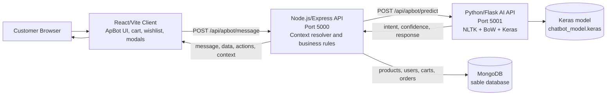
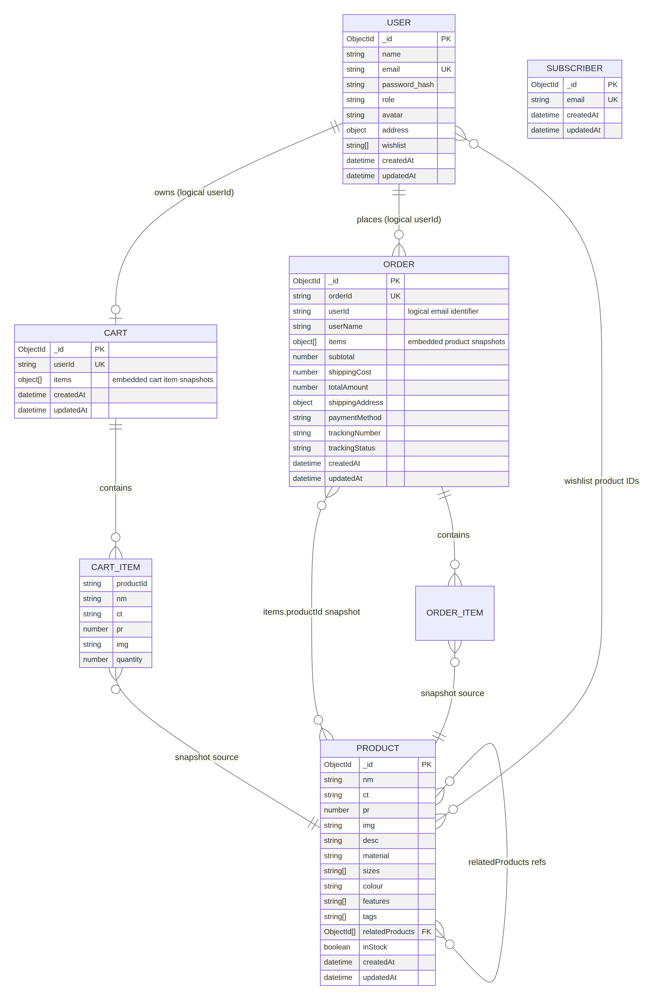

# ApBot E-Commerce Assistant — Complete Project Documentation

**Project:** SABLE E-Commerce with ApBot AI Shopping Assistant  
**Author:** Mujtaba Zadaii  
**Documentation author:** Manus AI  
**Audit date:** 18 August 2026  
**Repository:** [MujtabaZadaii/APBOT_E-commerce][2]  
**Audit commit:** `6a490eefafd2c64f11d37ceea0aa23bbaaf0217f`

## 1. Executive Summary

SABLE is a luxury-fashion e-commerce application integrated with ApBot, a conversational shopping assistant. The system combines a React/Vite user interface, a Node.js/Express application server, a Python/Flask TensorFlow service for intent classification, and MongoDB persistence. The original SRS defines an e-commerce assistant that should understand user messages, answer product and support questions, help with order tracking, and redirect users toward checkout. The repository contains a substantial implementation of these core layers, a trained Keras model, a Jupyter notebook, seed scripts, MongoDB schemas, and submission documentation.[1] [2]

The repository is **not fully production-complete as currently committed**, although it is a strong academic prototype. The frontend builds successfully and the JavaScript/Python source passes syntax checks. However, several advertised features are simplified implementations rather than full AI or production integrations. The most important gaps are the visual search implementation, real payment processing, persistent issue-report submission, the missing ApBot callback props, the undefined `setActiveCartItems` reference, and the absence of the automated test file referenced in the root README. These findings are incorporated into the requirements matrix rather than hidden behind marketing claims.

> **Final verdict:** The project is suitable as an academic demonstrator and can satisfy the SRS core chatbot objective after minor corrections. It should not be described as a fully production-ready multimodal commerce platform until the high-priority gaps in Section 15 are resolved.

## 2. Source Documents and Audit Method

This documentation was prepared by comparing the user-provided `AI&MachineLearningManiaSRS.pdf` with the public repository, its source code, model artifacts, configuration files, and existing submission documents. The audit covered the tracked repository files at the commit stated above, including the React client, Express server, Flask service, TensorFlow training code, MongoDB models, seed script, notebook, and existing reports. The frontend production build was executed with `npm run build`; Node.js source syntax and Python module compilation were also checked.

The SRS requires a website integrated with a chatbot, intent/pattern data, NLU/NLP processing, TensorFlow/Keras training, a REST API, product assistance, order tracking, installation instructions, source code, test data, diagrams, assumptions, and public GitHub access.[1] The audit therefore distinguishes three states: **Implemented**, meaning evidence exists in the current code; **Partially implemented**, meaning a working prototype exists but the behavior is simplified or incomplete; and **Not independently verified**, meaning the repository contains a claim or document but the corresponding test could not be reproduced from the committed files.

## 3. Problem Definition

Traditional e-commerce search requires users to navigate categories, filters, product cards, and checkout screens separately. This creates friction when a customer wants to express a natural request such as “show me a black jacket under £200,” ask for a size recommendation, refer to “the first one,” or track an order conversationally. The purpose of ApBot is to provide a 24/7 assistant that reduces this friction by classifying user intent, querying product and order data, and returning conversational guidance.

The project is designed for luxury fashion browsing and customer assistance. It is not a general-purpose chatbot. Out-of-scope questions are redirected to SABLE-related services, which is consistent with the SRS boundary that the application should focus on product information, common support requests, order tracking, and checkout guidance.[1]

## 4. Objectives

The system objectives are to provide natural-language product discovery, integrate an intent-classification model with a website, maintain conversational context, retrieve product information from MongoDB, support cart/wishlist/order flows, provide order-status assistance, and offer a usable responsive interface. The repository also extends the original minimum scope with voice dictation, text-to-speech, an outfit builder, size-fit guidance, and a visual-search entry point.[2]

The model-training objective is implemented through `apbot/train.py`, which loads the intents dataset, creates a vocabulary and class list, converts utterances into binary Bag-of-Words vectors, and trains a Dense/Dropout/Softmax Keras model for 200 epochs.[3] The runtime predictor loads the saved model and artifacts and applies a confidence threshold before returning an intent response.[4]

## 5. Scope and Boundaries

| Area | Included in the current system | Boundary or qualification |
|---|---|---|
| Product discovery | Category, keyword, colour, price, and similar-product queries against MongoDB | Matching is primarily regex and keyword based in the Express layer |
| Conversational context | Previous product IDs, category, colour, price, and checkout state | Context is passed from the browser and persisted in local storage |
| Product details | Price, material, sizes, description, stock, and related product information | Data quality depends on MongoDB seed/production data |
| Cart and wishlist | Add, remove, clear, view, and wishlist toggle actions | The main React cart is primarily local state/local storage; server cart APIs also exist |
| Checkout | Address and payment-form prototype, order document creation | No payment gateway or real payment authorization is implemented |
| Order tracking | Order ID lookup and time-based status calculation | No external courier or carrier API is connected |
| Voice | Browser Speech Recognition input and browser speech synthesis output | Depends on browser support and permissions |
| Visual search | Image-picker entry point and filename/keyword matching | No image bytes or visual embeddings are sent to a vision model |
| Support reports | Client-side issue-report confirmation and contact-page navigation | No persistent report API, email, or ticketing integration is present |
| General knowledge | Deliberate out-of-scope fallback | Not intended to answer unrelated questions |

## 6. System Architecture

The system is organized as three application services and one database layer. The browser runs the React interface and ApBot panel. The Node.js server is the orchestration layer: it receives messages, forwards text to the Python predictor, resolves product/order data, applies conversational rules, and returns a structured JSON response containing a message, data payload, actions, and context. The Flask service performs NLTK preprocessing and TensorFlow/Keras intent classification. MongoDB stores users, products, carts, orders, and newsletter subscribers.



The implementation uses browser-local context and state for much of the client experience. `ApBot.jsx` sends `message`, `context`, and `cartItems` to the Node API, then executes returned actions such as `add_to_cart`, `wishlist_add`, `open_checkout`, `open_tracking`, and navigation actions.[11] `App.jsx` owns the principal user, cart, wishlist, order, and modal state.[12]

## 7. Functional Modules

| Module | Primary files | Responsibility |
|---|---|---|
| React application | `client/src/App.jsx`, `client/src/components/*` | Product browsing, modal orchestration, cart, wishlist, checkout, profile, orders, and tracking UI |
| ApBot client | `client/src/components/ApBot.jsx` | Chat interface, browser voice/TTS, context storage, inline forms, and action dispatch |
| Express bootstrap | `server/server.js` | Middleware, route registration, health endpoint, and database startup |
| AI conversation route | `server/routes/apbotRoutes.js` | Python prediction call, fallback rules, context resolution, DB queries, and action payloads |
| Authentication | `server/routes/authRoutes.js`, `server/middleware/auth.js` | Registration, login, bcrypt password comparison, JWT creation and verification |
| Product API | `server/routes/productRoutes.js`, `server/models/Product.js` | Product listing, detail retrieval, and product creation |
| Cart API | `server/routes/cartRoutes.js`, `server/models/Cart.js` | User-associated cart persistence and cart clearing |
| Order API | `server/routes/orderRoutes.js`, `server/models/Order.js` | Order creation, user order history, tracking lookup, and status updates |
| AI service | `apbot/app.py`, `apbot/chatbot/*`, `apbot/train.py` | Intent prediction, preprocessing, model training, and health endpoint |
| Data initialization | `server/seed.js`, migration scripts | Product seed data and product-field migrations |

## 8. SRS Requirements Traceability

### 8.1 Functional Requirements

| SRS requirement | Current evidence | Status | Assessment |
|---|---|---:|---|
| Pattern matching through anticipated inputs and responses | `apbot/data/intents.json`, tokenizer and Bag-of-Words pipeline | Implemented | The dataset and preprocessing flow are present. |
| NLU intent, context, and expectation recognition | TensorFlow predictor plus Express context resolver | Partially implemented | Intent classification is real; context resolution is mainly explicit rule logic in Node. |
| NLP tokenization and vectorization | NLTK tokenization, lemmatization, and binary BoW encoder | Implemented | Source and trained artifacts are committed.[3] [4] |
| TensorFlow/Keras chatbot model | `train.py`, `chatbot_model.keras`, `words.pkl`, `classes.pkl` | Implemented | The model artifact and training code are present. |
| Frontend chatbot interface | React ApBot panel with text, mic, TTS, image-picker, cards, and forms | Implemented | The UI is present and the production build passes. |
| Backend REST API | Flask `/api/apbot/predict` and Express `/api/apbot/message` | Implemented | Both API layers exist. |
| Product information and recommendations | MongoDB Product queries with filters and similar-category lookup | Implemented | Product information is database-backed. |
| Order tracking | `Order` lookup by `SBL-*` code and time-based status calculation | Partially implemented | It is a local simulation, not live carrier tracking. |
| Common FAQs and support | Intent responses and hardcoded policy/support responses | Implemented | Appropriate for the academic scope, but not CMS-backed. |
| Checkout redirection | `checkout` action, address form, payment form, and order creation | Partially implemented | The flow creates an order but does not process a real payment. |
| Website integration | React-to-Express-to-Flask-to-Mongo flow | Implemented | The main integration path is present. |
| Public GitHub source | Public repository and source folders | Implemented | Repository is publicly accessible.[2] |
| Notebook deliverable | `apbot/notebooks/ApBot_Training.ipynb` | Implemented | Notebook is committed. |

### 8.2 Non-Functional Requirements

| SRS requirement | Evidence and finding | Status |
|---|---|---:|
| Browser compatibility | Standard React/Vite application and Web Speech API feature detection | Partially implemented |
| Security against unauthorized access | JWT middleware, bcrypt hashing, protected address/wishlist/order operations | Partially implemented |
| User experience | Responsive UI, animations, loading states, product cards, and fallback messages | Implemented at prototype level |
| Performance | Lightweight local action handling and a trained model | Not independently verified |
| Reliability and graceful failure | ApBot route catches Python fetch failures; DB startup currently exits on connection failure | Partially implemented |
| Concurrent-user scalability | Decoupled services are a suitable starting point | Not independently verified |
| Data-loss prevention | Local storage is used for client state; no backup/restore or transaction strategy is documented | Not verified |

## 9. Database Design

The database is MongoDB database `sable`. The schema is document-oriented: product data is stored in `Product`, user profile and wishlist data in `User`, carts in `Cart`, orders in `Order`, and newsletter addresses in `Subscriber`. Cart and order items are embedded snapshots. The item snapshots preserve the name, price, image, and quantity at the time of the cart/order operation, but they are not strict Mongoose references to the current Product document.[5] [6] [7] [8] [9]



The editable diagram source is available at `assets/apbot_db_schema.mmd`. The logical relations are as follows:

| Relationship | Current representation | Design implication |
|---|---|---|
| User to Cart | `Cart.userId` stores the user email as a unique string | One logical cart per user; no ObjectId foreign key is enforced |
| User to Order | `Order.userId` stores the user email as a string | Order history is associated by email, not by `User._id` |
| User to Product | `User.wishlist` stores product IDs as strings | Wishlist integrity depends on application logic |
| Product to Product | `Product.relatedProducts` stores ObjectId references | This is the strongest explicit product relationship |
| Cart to Product | `Cart.items.productId` plus denormalized item fields | Snapshot can become stale if the product changes |
| Order to Product | `Order.items.productId` plus denormalized item fields | Suitable for historical display; price integrity should be validated server-side |
| Subscriber | Independent email collection | No relationship to User is defined |

### 9.1 Collection Specifications

#### Product

The Product schema includes the display name `nm`, category `ct`, price `pr`, image `img`, description `desc`, material, sizes, colour, features, tags, related product IDs, stock flag, and timestamps. This collection is the primary source for product discovery and product detail responses.[5]

#### User

The User schema includes name, unique lowercase email, password, role, avatar, an embedded address object, a string-array wishlist, and timestamps. Passwords are hashed in a pre-save hook with `bcryptjs`; however, the comparison method contains a plaintext fallback for passwords that do not begin with a bcrypt prefix, which should be removed before production deployment.[6]

#### Cart

The Cart schema has a unique logical `userId` and an embedded `items` array. Each item stores product ID, name, category, price, image, and quantity. This supports snapshot-style cart persistence, but the frontend currently maintains its active cart mainly in React state and local storage.[7] [12]

#### Order

The Order schema stores a unique `orderId`, logical user identifier, customer name, embedded item array, totals, shipping address, payment-method label, tracking number, tracking status, and timestamps. Order creation is implemented in the conversational checkout route.[8] [10]

#### Subscriber

The Subscriber schema stores a unique lowercase email and timestamps for newsletter subscriptions.[9]

## 10. API Inventory

| Method | Endpoint | Purpose | Authentication |
|---|---|---|---|
| GET | `/api/health` | API health response | Public |
| GET | `/api/products` | List products | Public |
| GET | `/api/products/:id` | Get product detail | Public |
| POST | `/api/products` | Create product | No explicit admin guard in current route |
| POST | `/api/auth/register` | Register user and return JWT | Public |
| POST | `/api/auth/login` | Authenticate user and return JWT | Public |
| POST | `/api/apbot/message` | Process chat message and return actions/data/context | Optional bearer token |
| POST | `/api/apbot/predict` | Python intent prediction endpoint | Internal Flask service |
| GET | `/api/cart/:userId` | Retrieve/create user cart | Optional token with same-user check |
| POST | `/api/cart/save` | Save cart items | Optional token |
| DELETE | `/api/cart/clear/:userId` | Clear cart | Optional token with same-user check |
| POST | `/api/orders/create` | Create an order | Optional token in current implementation |
| GET | `/api/orders/user/:userId` | Retrieve user orders | Same-user protection |
| GET | `/api/orders/track/:code` | Find order by order/tracking code | Public lookup by code |
| PUT | `/api/orders/update-status` | Update an order status | No explicit admin guard in current route |
| POST | `/api/user/address` | Update authenticated address | Required JWT |
| GET | `/api/user/wishlist` | Retrieve wishlist | Optional token; email query is accepted for guests |
| POST | `/api/user/wishlist/toggle` | Add/remove wishlist item | Required JWT |
| POST | `/api/subscribers/subscribe` | Create newsletter subscription | Public |

The route inventory shows that the application has a useful prototype API surface, but production hardening should add role-based authorization to product creation and order-status updates, rate limiting, request validation, and stricter ownership checks.

## 11. AI/NLP Pipeline

The training pipeline reads intent tags, patterns, and responses from `apbot/data/intents.json`. It tokenizes patterns with NLTK, normalizes words through lemmatization, removes punctuation, builds a vocabulary, converts each pattern to a binary Bag-of-Words vector, and trains a Keras Sequential classifier. The saved outputs are the trained Keras model, vocabulary pickle, and class-label pickle.[3] [4]

At inference time, the Flask service receives a text message, invokes the predictor, and returns an intent, confidence score, response text, and context. The Express route then enriches the result with product/order database queries and frontend actions. This division is appropriate for demonstrating a microservice architecture. It should be described as an **intent-classification assistant with deterministic commerce rules**, not as a fully generative or end-to-end autonomous shopping model.

## 12. User and Conversation Flows

### Product discovery flow

The user submits a message through the ApBot panel. The client sends the current context to Express. Express asks the Python service for an intent prediction, applies explicit filters such as colour and price, queries MongoDB, formats product cards, stores the returned product IDs in context, and sends the response to React. A subsequent message such as “the first one” is resolved against the saved product list.

### Checkout flow

The client requests checkout. The backend checks whether the cart is non-empty and whether the user is authenticated. It returns an address form, validates a textual address, returns a payment form, accepts a payment-method string, constructs an Order document, and returns a `place_order` action. This is a functional academic checkout simulation; it must not be presented as a real payment transaction because no payment processor is contacted and no payment authorization is performed.[10] [11]

### Order tracking flow

The user supplies an `SBL-*` code or asks for a recent order. The backend looks up the order and calculates a simulated status from elapsed time since `createdAt`. The statuses progress from Order Placed to Processing, In Transit, Out for Delivery, and Delivered. This is a deterministic local timeline, not an external courier integration.[10]

## 13. Installation and Execution Instructions

### Prerequisites

The project requires Git, Node.js, Python 3.10 or newer, and MongoDB. The repository documentation recommends local MongoDB at `mongodb://localhost:27017/sable` or an Atlas URI.[2] TensorFlow installation may require a compatible Python version and operating-system-specific wheel support.

### Installation

```bash
git clone https://github.com/MujtabaZadaii/APBOT_E-commerce.git
cd APBOT_E-commerce

# Install frontend dependencies
npm --prefix client install

# Install backend dependencies
npm --prefix server install

# Create backend environment file
cp server/.env.example server/.env
# Edit server/.env and set MONGO_URI and JWT_SECRET before use

# Create Python environment
cd apbot
python -m venv venv

# macOS/Linux
source venv/bin/activate

# Windows PowerShell
# .\\venv\\Scripts\\Activate.ps1

pip install -r requirements.txt
python -c "import nltk; nltk.download('punkt'); nltk.download('wordnet')"
cd ..
```

### Model training and database seeding

The committed model artifacts allow the AI service to start without retraining in the normal case. If retraining is required, activate the Python environment and run:

```bash
python apbot/train.py
node server/seed.js
```

The seed script currently initializes a small local product dataset. Before using it on a shared database, confirm that deleting existing Product documents is acceptable because the seed operation resets the Product collection.

### Running services

Run the following processes in separate terminals:

```bash
# Terminal 1: Python AI service
cd apbot
source venv/bin/activate
python app.py

# Terminal 2: Node.js API
cd server
npm start

# Terminal 3: React client
cd client
npm run dev
```

Open the Vite URL shown by the terminal, normally `http://localhost:5173` unless the Vite configuration changes it. The repository README states port 3000, so the actual configured Vite port should be checked before submission.[2] The frontend source currently hardcodes the backend base URL as `http://localhost:5000` in several components; production deployment should replace these values with an environment-based API URL.

## 14. Verification Results

| Check | Command or evidence | Result | Interpretation |
|---|---|---:|---|
| Frontend production build | `npm ci` followed by `npm run build` in `client` | PASS | Vite transformed 1,854 modules and produced the `dist` bundle |
| Backend JavaScript syntax | `node --check` on server, routes, models, and middleware | PASS | No syntax errors detected |
| Python syntax | `python3 -m py_compile` on Flask, training, and chatbot modules | PASS | No Python syntax errors detected |
| Model artifacts | `chatbot_model.keras`, `words.pkl`, `classes.pkl` committed | PASS | Runtime artifacts exist in the repository |
| Notebook deliverable | `apbot/notebooks/ApBot_Training.ipynb` committed | PASS | Jupyter artifact exists |
| Existing test matrix | `submission/Test_Cases.md` claims 24 passes | Not independently verified | The referenced `scratch/test_conversations.js` file is not present in the current tracked repository |
| Runtime with MongoDB absent | `server/config/db.js` calls `process.exit(1)` on connection failure | FAIL for disconnected mode | The server does not actually continue in disconnected mode as the bootstrap comment suggests |

The existing test document reports a 100% result across 24 scenarios, but the current repository does not contain the automated test script named in the root README. Therefore, the 24-case result should be labelled as a historical/manual claim until the test runner and its fixtures are committed and executed again.[14]

## 15. Completeness Audit and Required Corrections

### High-priority corrections

| Priority | Finding | Impact | Recommended correction |
|---|---|---|---|
| High | `ApBot.jsx` uses `onOpenOrders` and `onClearCart`, but these props are not destructured in the component signature | The order-opening action can throw a `ReferenceError`; clear-cart callback is unavailable | Add both props to the component signature and add a focused UI test |
| High | `App.jsx` passes `onClearCart={() => setActiveCartItems([])}`, but `setActiveCartItems` is not defined | Clear-cart action can fail at runtime | Replace with a handler that clears `guestCart` or the logged-in user’s `userCarts` entry |
| High | Payment form accepts card number, expiry, and CVV but sends only “Card ending in ####” to the backend | No real payment processing or authorization occurs | Integrate a payment provider or clearly label the flow as a mock payment simulation; never store raw card data |
| High | Visual search converts the selected file into a filename text query | The feature is not image understanding or visual embedding search | Upload image bytes securely and call a vision/embedding service, or rename the feature to “catalog keyword search from image filename” |
| High | Issue report form generates a client-side random ID only | No report is persisted or delivered to support | Add a report collection and API, validation, authenticated ownership, and notification workflow |
| High | Backend defaults to a hardcoded JWT secret and `config/db.js` exits on DB failure | Security and availability risk | Require `JWT_SECRET` in production and implement explicit startup failure/health behavior rather than an inaccurate disconnected-mode claim |

### Medium-priority corrections

| Priority | Finding | Recommended correction |
|---|---|---|
| Medium | Size-fit logic primarily uses weight; parsed height does not affect the result | Use a documented sizing table or a trained/validated fit model and explain limitations |
| Medium | Outfit builder returns the first three products | Filter by category, compatibility, user preferences, and inventory before claiming AI curation |
| Medium | Order status is calculated from elapsed time and is not carrier-backed | Label as simulated tracking or integrate a carrier/order-event service |
| Medium | Cart and orders are heavily local-storage driven in the React app | Make MongoDB the authoritative source after authentication and reconcile local guest carts on login |
| Medium | Product creation and order-status update routes lack explicit admin authorization | Add role-based access checks and audit logging |
| Medium | CORS, input validation, rate limits, and structured logging are not production hardened | Add environment-based CORS allowlists, schema validation, rate limiting, and observability |
| Medium | Frontend API URLs are hardcoded to localhost | Use Vite environment variables and a deployment-safe API configuration |

## 16. Corrected Assumptions

The following assumptions should replace older statements that overstate the implementation:

| Assumption | Correct interpretation |
|---|---|
| Database availability | MongoDB must be running for product, cart, user, and order operations; the current DB helper exits on connection failure |
| Product seed size | The current `server/seed.js` is a small development seed; the production inventory size must not be assumed from marketing text |
| Visual search | The current implementation is filename/keyword matching and does not perform image embedding or tensor-based similarity search |
| Payment | The checkout path creates an order after receiving a payment-method string; it is not a payment gateway integration |
| Order tracking | Tracking is a local time-based simulation unless an external carrier service is added |
| Voice | Speech recognition and TTS depend on browser support, permission, and device audio capabilities |
| Authentication | JWT and bcrypt are present, but production security still requires secret management, route authorization, validation, and rate limiting |
| Test evidence | The existing 24-case matrix is documentation evidence, not independently reproducible automated evidence until the missing test runner is committed |

## 17. Future Enhancement Roadmap

The recommended implementation order is to fix the two frontend callback defects, add a real automated test runner, move API URLs and secrets into environment configuration, and secure administrative routes. The next phase should make MongoDB authoritative for authenticated carts and orders and add request validation, error contracts, logging, and health checks.

After that foundation is stable, the application can add a real payment provider in test mode, persistent support tickets, a proper image-upload/embedding pipeline, a product-compatibility model for outfit recommendations, and a documented sizing model. Finally, deployment should include HTTPS, secret management, database indexes, backups, monitoring, rate limits, and a reproducible CI pipeline.

## 18. Conclusion

ApBot is a meaningful full-stack academic project with real source code across frontend, backend, machine-learning, database, and documentation layers. Its strongest verified capabilities are intent classification, NLTK/Bag-of-Words preprocessing, MongoDB-backed product retrieval, conversational product context, JWT/bcrypt-based account flows, and a React-integrated assistant interface. The project is therefore substantially complete as a prototype.

The correct academic description is **“a TensorFlow/Keras intent-classification e-commerce assistant with deterministic product, cart, checkout-simulation, and order-tracking workflows.”** This wording is accurate, defensible, and aligned with the current source. Claims such as real visual AI search, secure payment processing, live courier tracking, persistent support tickets, or full production readiness should only be added after the corrections in Section 15 are implemented and re-tested.

## References

[1]: https://github.com/MujtabaZadaii/APBOT_E-commerce/blob/main/submission/README.md "Repository submission README; the SRS PDF used in this audit was supplied by the user as an attachment"
[2]: https://github.com/MujtabaZadaii/APBOT_E-commerce "Public APBOT_E-commerce GitHub repository"
[3]: https://github.com/MujtabaZadaii/APBOT_E-commerce/blob/main/apbot/train.py "ApBot TensorFlow/Keras training script"
[4]: https://github.com/MujtabaZadaii/APBOT_E-commerce/blob/main/apbot/chatbot/predictor.py "ApBot runtime predictor"
[5]: https://github.com/MujtabaZadaii/APBOT_E-commerce/blob/main/server/models/Product.js "Product Mongoose schema"
[6]: https://github.com/MujtabaZadaii/APBOT_E-commerce/blob/main/server/models/User.js "User Mongoose schema"
[7]: https://github.com/MujtabaZadaii/APBOT_E-commerce/blob/main/server/models/Cart.js "Cart Mongoose schema"
[8]: https://github.com/MujtabaZadaii/APBOT_E-commerce/blob/main/server/models/Order.js "Order Mongoose schema"
[9]: https://github.com/MujtabaZadaii/APBOT_E-commerce/blob/main/server/models/Subscriber.js "Subscriber Mongoose schema"
[10]: https://github.com/MujtabaZadaii/APBOT_E-commerce/blob/main/server/routes/apbotRoutes.js "Conversational ApBot backend route"
[11]: https://github.com/MujtabaZadaii/APBOT_E-commerce/blob/main/client/src/components/ApBot.jsx "ApBot React client component"
[12]: https://github.com/MujtabaZadaii/APBOT_E-commerce/blob/main/client/src/App.jsx "Main React application state and wiring"
[13]: https://github.com/MujtabaZadaii/APBOT_E-commerce/blob/main/server/config/db.js "MongoDB connection configuration"
[14]: https://github.com/MujtabaZadaii/APBOT_E-commerce/blob/main/submission/Test_Cases.md "Existing ApBot test-case matrix"
[15]: https://github.com/MujtabaZadaii/APBOT_E-commerce/blob/main/docs/SRS_COMPLIANCE.md "Existing repository SRS compliance document"
